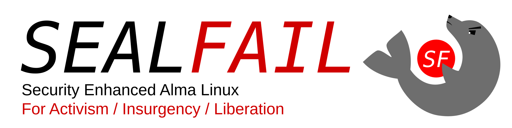

-----

#Security is for everyone.

As our lives are propelled through an increasingly threatening symbiosis of **surveillance capitalism**, authoritarian states, and their sponsored militias, the need for accessible security tools is becoming more apparent **by the day.**

**SEALFAIL is a secure operating system** designed from the ground up to help put activists and militant organizations on an equal footing against such threat actors **by empowering them** with a powerful and **accessible** tool to help implement communication, information, and operation security procedures. (COMSEC/INFOSEC/OPSEC)